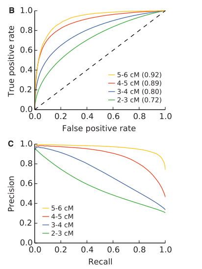

* Adoption error: http://www.census.gov/prod/2003pubs/censr-6.pdf
* multiple partners: https://www.census.gov/prod/2011pubs/p70-125.pdf
* non-paternity: https://en.wikipedia.org/wiki/Non-paternity_event
* IBD error: https://mbe.oxfordjournals.org/content/early/2014/05/23/molbev.msu151.full.pdf+html

IBD error
=========
Figure 4 from [this paper](https://mbe.oxfordjournals.org/content/early/2014/05/23/molbev.msu151.full.pdf+html) provides a means of simulating IBD detection error.

Current plan: Ignore segments shorter than 5cM, have error function between 5 and 10 cM. Completely accurate over 10 cM.
